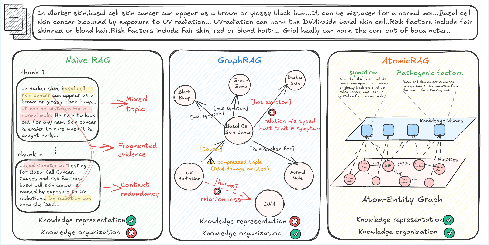
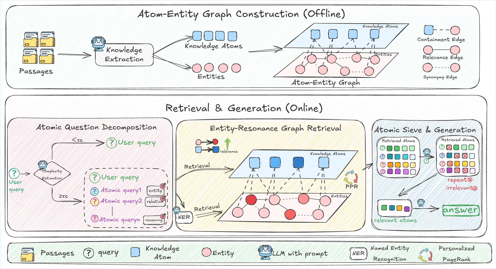

# AtomicRAG: Atom-Entity Graphs for Retrieval-Augmented Generation

[](https://arxiv.org/abs/2604.20844)
[](https://github.com/7HHHHH/AtomicRAG)

Official implementation of **AtomicRAG: Atom-Entity Graphs for Retrieval-Augmented Generation**.

AtomicRAG is a graph-based retrieval-augmented generation framework that stores knowledge as fine-grained, self-contained **knowledge atoms** rather than coarse text chunks or predicate-only triples. It builds an **Atom-Entity Graph (AEG)**, retrieves evidence through entity-aware graph propagation, and filters retrieved atoms before grounded answer generation.

Paper: [arXiv:2604.20844](https://arxiv.org/abs/2604.20844)
Code: [https://github.com/7HHHHH/AtomicRAG](https://github.com/7HHHHH/AtomicRAG)

## Overview

AtomicRAG addresses two common failure modes in GraphRAG-style systems:

- Coarse chunk-level storage entangles multiple facts in one retrieval unit, which adds noise for fine-grained or multi-hop questions.
- Predicate-labeled triple graphs can be brittle when relation extraction is incomplete or incorrect.

## Motivation

<p align="center">
  
</p>

## Framework

<p align="center">
  
</p>

The pipeline has four stages:

1. **Atom-Entity Graph Construction**: decomposes corpus chunks into knowledge atoms, extracts entities, and constructs an unlabeled weighted graph with containment, relevance, and synonym edges.
2. **Atomic Question Decomposition**: scores query complexity and decomposes only complex questions into up to three atom-aligned sub-questions.
3. **Entity-Resonance Graph Retrieval**: combines dense atom retrieval with entity seeds and Personalized PageRank over the AEG.
4. **Atomic Sieve and Answer Generation**: filters redundant or irrelevant atoms and passes a compact evidence set to the generator.

## Repository Layout

```text
atomicrag/                  Core AtomicRAG implementation
  atomicrag.py              Indexing, retrieval, graph propagation, QA
  fragment_filter.py        Atomic Sieve implementation
  query_decomposition.py    Complexity scoring and query decomposition
Evaluation/                 Generation-quality evaluation
scripts/                    Dataset runners and helper scripts
configs/atomicrag/          Runtime configuration templates
dataset/                    Graph-Bench-style corpus folders used by scripts
datasets/atomicrag/         Additional precise-QA data files
workspaces/                 Generated graph/vector caches
results/                    Predictions, evaluation files, and run statistics
```

`workspaces/`, `results/`, logs, and `configs/atomicrag/llm.env` are ignored by git because they contain generated artifacts or private credentials. The benchmark data under `dataset/` and `datasets/` is intended to be versioned for the public release.

## Installation

Python 3.10 is recommended.

```bash
conda create -n atomicrag python=3.10 -y
conda activate atomicrag

pip install -r requirements/atomicrag.txt
pip install -r requirements.txt
pip install -e .
```

The default embedding model is `BAAI/bge-large-en-v1.5`. Make sure the model can be downloaded from Hugging Face, or set your local Hugging Face cache/offline environment variables before running.

## Configuration

AtomicRAG uses OpenAI-compatible chat APIs for LLM calls. You can configure credentials through environment variables or `configs/atomicrag/llm.env`.

```bash
export LLM_BASE_URL=https://api.openai.com/v1
export LLM_API_KEY=your_api_key
export OPENAI_API_KEY=$LLM_API_KEY
export CUDA_VISIBLE_DEVICES=0
```

Application-level concurrency defaults live in `configs/atomicrag/config.json`:

```json
{
  "models": {
    "openai": {
      "max_concurrency": 200
    }
  },
  "evaluation": {
    "max_concurrency": 200
  }
}
```

For local setup, copy `configs/atomicrag/llm.env.example` to `configs/atomicrag/llm.env` and fill in your own API settings. Only the example file is versioned.

## Data Format

The main runner expects each subset to contain one or more corpus directories:

```text
dataset/<subset>/<corpus_name>/
  chunks.json
  questions.json
```

`chunks.json` is a list of source text chunks.
`questions.json` is a list of QA records with at least:

```json
{
  "id": "example-id",
  "question": "question text",
  "answer": "reference answer"
}
```

Supported subsets in `scripts/run_atomicrag.py`:

- `medical`
- `novel`
- `hotpotqa`
- `musique`
- `2wikimultihop`

## Quick Start

Run AtomicRAG on the Medical subset:

```bash
python scripts/run_atomicrag.py \
  --subset medical \
  --base_dir ./workspaces/atomicrag \
  --results_dir ./results/atomicrag \
  --model_name gpt-4o-mini \
  --embed_model_path BAAI/bge-large-en-v1.5 \
  --llm_base_url "$LLM_BASE_URL" \
  --use_cache false \
  --concurrency 200 \
  --qa_prompt_template precise
```

Use cache after a graph has already been built:

```bash
python scripts/run_atomicrag.py \
  --subset medical \
  --base_dir ./workspaces/atomicrag \
  --results_dir ./results/atomicrag \
  --model_name gpt-4o-mini \
  --embed_model_path BAAI/bge-large-en-v1.5 \
  --llm_base_url "$LLM_BASE_URL" \
  --use_cache true \
  --concurrency 200 \
  --qa_prompt_template precise
```

Useful flags:

- `--use_cache true`: reuse existing OpenIE, embeddings, and graph cache when available.
- `--sample N`: run only a prefix sample for debugging.
- `--qa_prompt_template precise`: use concise QA prompts for short-answer benchmarks.

## Running All Benchmarks

The shell helpers in `scripts/` run common dataset groups:

```bash
bash scripts/run_medical.sh
bash scripts/run_novel.sh
bash scripts/run_hotpotqa.sh
bash scripts/run_musique.sh
bash scripts/run_2wikimultihop.sh
bash scripts/run_all_datasets.sh
```

Outputs are written under `results/atomicrag/` by default:

```text
results/atomicrag/<corpus_name>/
  predictions_<corpus_name>.json
  statistics_<corpus_name>_<timestamp>.json
  eval_generation_<corpus_name>.json
```

## Evaluation

Evaluate a prediction file with the Graph-Bench-style `answer_correctness` metric:

```bash
python -m Evaluation.generation_eval \
  --model gpt-4o-mini \
  --base_url "$LLM_BASE_URL" \
  --embedding_model BAAI/bge-large-en-v1.5 \
  --data_file results/atomicrag/Medical/predictions_Medical.json \
  --output_file results/atomicrag/Medical/eval_generation_Medical.json \
  --concurrency 200
```

Average the 20 Novel corpus evaluations:

```bash
python scripts/average_novel_results.py \
  --results_dir results/atomicrag \
  --output_file results/atomicrag/eval_generation_novel_averaged.json
```

## Paper Default Configuration

The implementation defaults are aligned with the paper configuration.

| Component / parameter | Value |
|---|---:|
| LLM | `gpt-4o-mini` |
| Embedding model | `BAAI/bge-large-en-v1.5` |
| `embedding_max_seq_len` | `2048` |
| `retrieval_top_k` | `25` |
| `qa_top_k` | `25` |
| `synonymy_edge_topk` | `2047` |
| `synonymy_edge_sim_threshold` | `0.8` |
| `entity_node_weight` | `1.0` |
| `entity_top_k` | `20` |
| `entity_sim_threshold` | `0.3` |
| Propagation method | `ppr` |
| `damping` | `0.3` |
| `passage_node_weight` | `0.1` |
| `max_sub_questions` | `3` |
| `complexity_threshold` | `6.5` |
| Chunk size / overlap | `256 / 32` |

## Reported Main Results

The paper reports Answer Accuracy (ACC, %) on Graph-Bench and multi-hop QA benchmarks.

| Benchmark | Fact | Reason | Summ. | Creat. | Avg. |
|---|---:|---:|---:|---:|---:|
| Graph-Bench Medical | 72.6 | 74.8 | 76.8 | 68.3 | 73.1 |
| Graph-Bench Novel | 61.0 | 53.4 | 68.5 | 60.0 | 60.7 |

| Benchmark | HotpotQA | 2WikiMultiHopQA | MuSiQue | Avg. |
|---|---:|---:|---:|---:|
| Multi-hop QA | 70.5 | 56.8 | 50.9 | 59.4 |

Overall average across reported task columns: **64.9**.

## Citation

If you use AtomicRAG in your work, please cite:

```bibtex
@misc{hou2026atomicrag,
  title         = {AtomicRAG: Atom-Entity Graphs for Retrieval-Augmented Generation},
  author        = {Yanning Hou and Duanyang Yuan and Sihang Zhou and Xiaoshu Chen and Ke Liang and Siwei Wang and Xinwang Liu and Jian Huang},
  year          = {2026},
  eprint        = {2604.20844},
  archivePrefix = {arXiv},
  primaryClass  = {cs.IR},
  url           = {https://arxiv.org/abs/2604.20844}
}
```

## Notes

- The package name is `atomicrag`.
- The current codebase is a research implementation; generated graph caches can be large.
- Personalized PageRank uses `python-igraph`; graph operations are guarded by locks because concurrent igraph calls are not thread-safe.
- For reproducibility, keep the model, embedding model, prompt template, cache mode, and concurrency settings fixed across runs.
